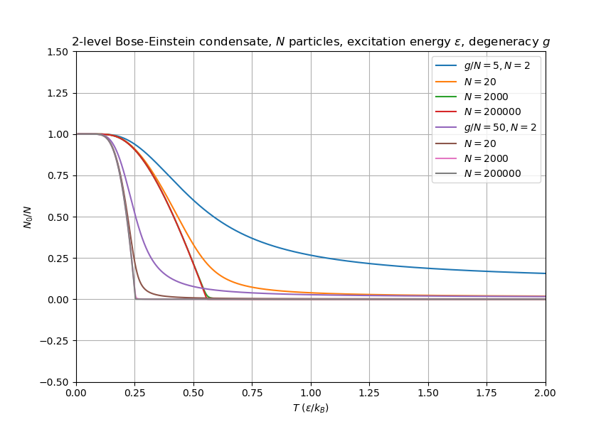

# 2-level-Bose-Einstein-condensation
A simple analytic model that illustrates the critical-temperature concept.

The simplest model I could find to show the critical-temperature concept for a Bose-Einstein condensation. It consists of a perfect gas of N bosons at temperature T, which have access to a non-degenerate fundamental level (chosen of zero energy) and an excited level of energy epsilon and degeneracy g. Using the Bose-Einstein distribution, one calculates the number of bosons in the fundamental level (N_0) and the number of bosons in the excited levels (N_*). The critical temperature, given (in units of epsilon/k_Boltzmann) by 1/ln(1+(g/N)) as can be checked analytically, clearly appears on the N_0(T) graph. Depending on the ratio g/N it ranges from 0 (large degeneracy) to infinity (small degeneracy).

The Jupyter Notebook or the Python code allow one to generate the following figure for instance.

